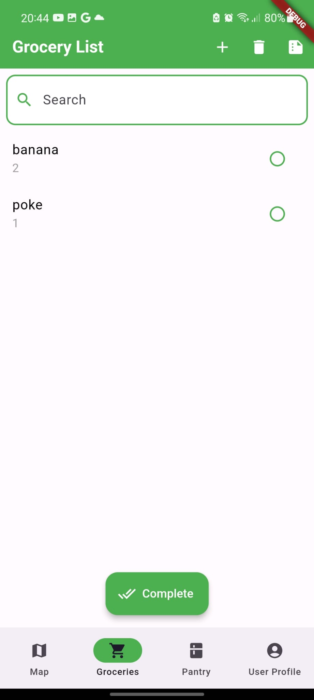
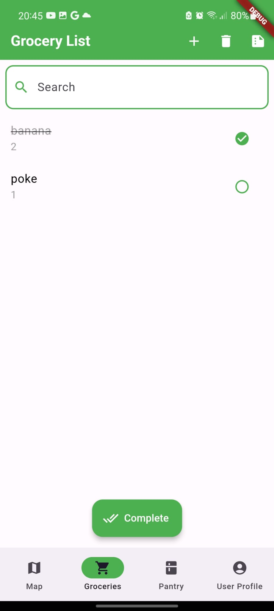
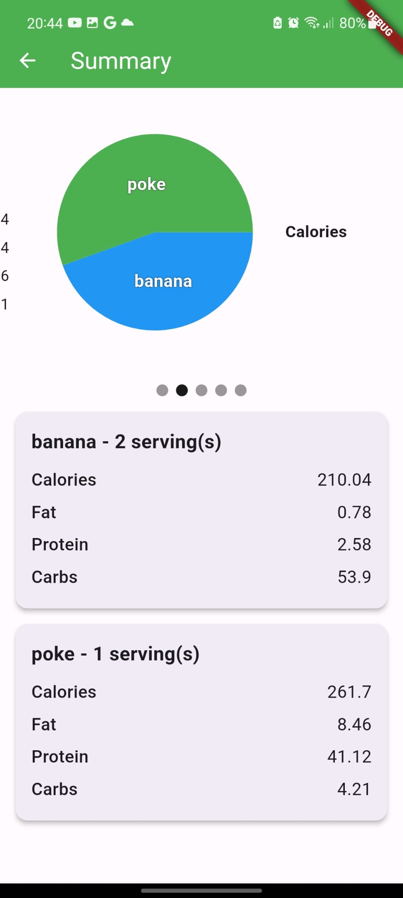
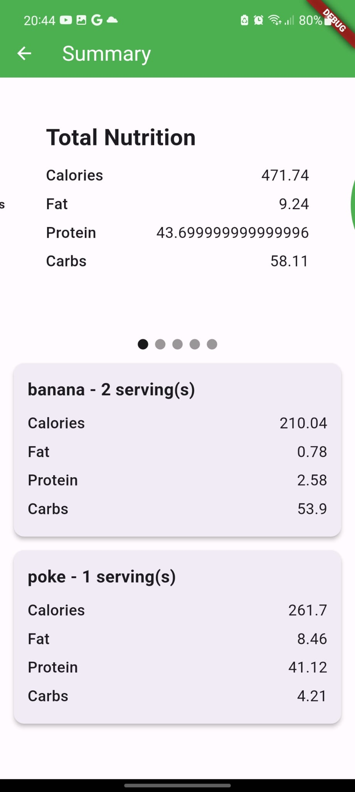
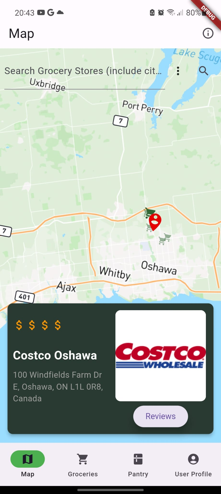
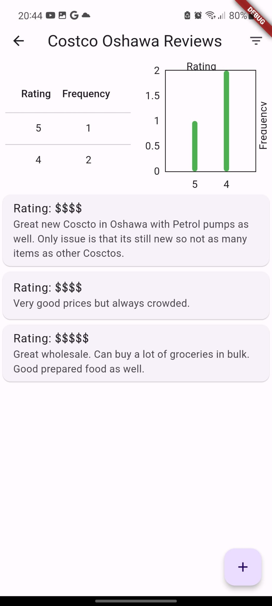
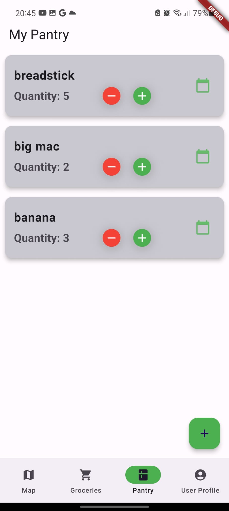

# Unifood Mobile Application
Contributors: \
Shian Li Chen \
Malhar Singh \
Johnny Liang

NOTE: INSTALLATION IS NOT POSSIBLE YET, FOR THE MOMENT IT IS ONLY POSSIBLE THROUGH ANDROID STUDIO.
## Overview

Welcome to **Unifood**, your all-in-one solution for managing your grocery shopping, pantry inventory, and nutritional insights. This mobile application, built using Flutter, is designed to streamline your grocery-related tasks and enhance your shopping experience.

## Table of Contents

1. [Grocery List](#grocery-list)
2. [Map](#map)
3. [Pantry](#pantry)
4. [User Profile](#user-profile)

## Grocery List

The **Grocery List** page is where you can manage your shopping items efficiently. Here are the key features:

- **Item Management:**
  - View a list of items for your shopping needs.
  - Add new items by tapping the "+" button, which opens a new tab with an autocomplete feature.
  - Autocomplete suggests items based on your input, and selecting an item displays its image.
  - Delete selected items with the dedicated button. 
&nbsp;

- **Nutritional Summary:**
  - Access a detailed nutritional summary of each item in the list by tapping the corresponding button.
  - Explore nutritional information through interactive graphs in a carousel fashion. 
&nbsp;

- **Complete and Move to Pantry:**
  - Use the floating button to complete your shopping.
  - Selected items will be sent to your Pantry for easy inventory management.

- **Local Database:**
  - Grocery List data is stored locally, ensuring fast and responsive access.

## Map

The **Map** page utilizes geolocation to help you locate nearby grocery stores. This feature makes it convenient for you to plan your shopping trips and discover new places. 
Users can also write reviews!  
&nbsp;

## Pantry

The **Pantry** page is your digital inventory where you can keep track of purchased items. Here's what you can do:

- **Item Management:**
  - View a list of items in your pantry.
  - Receive notifications for expiring items (manual date input).

- **Undo Feature:**
  - Reverse accidental deletions with the undo feature.

- **Cloud Database:**
  - Pantry data is securely stored in the cloud, ensuring synchronization across devices.
 

## User Profile

The **User Profile** page is a basic profile view where you can customize your account settings.
